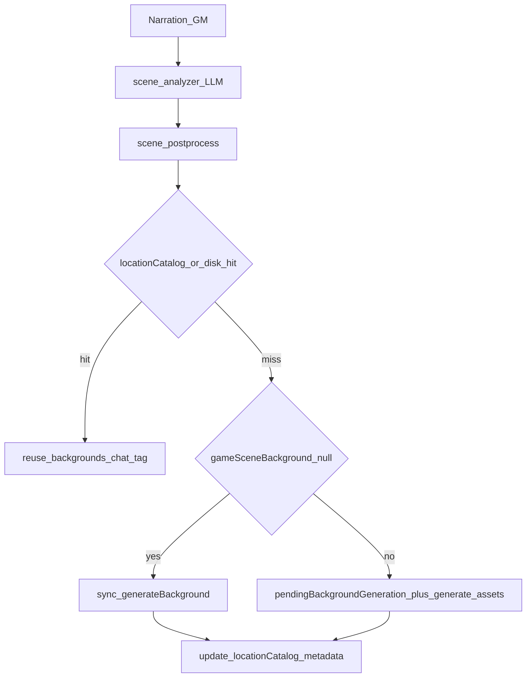

# v2 — Scene-aware generated backgrounds (Game mode)

> Обзор изменений: контекстные фоны по описанию сцены, per-chat кэш локаций и
> hybrid-синхронная/асинхронная генерация; follow-up по клиенту и legacy API.
> Дата: 2026-04-28.

## Зачем это сделано

**Было:** промпт для image API собирался по сути из **slug тега** (`backgrounds:generated:…` /
hallucinated tag), без текста нарратива; плюс LLM часто выбирал **«близкий» готовый тег**
из манифеста (`backgrounds:user:dark_forest`), который семантически не совпадал со сценой.

**Стало:** scene-analyzer возвращает **`backgroundPrompt`** (краткий визуальный brief),
стабильный **`locationId`**, **`season`**; сервер кэширует кадры по ключу
локация × погода × время суток × сезон внутри чата; генерация учитывает setting /
art style и усиленный негатив «без людей на фоне».

---

## Итоговая статистика (ядро фичи)

Оценка по семи основным файлам относительно базовой линии (`main`):

```
M 7 files
+ 1372 / − 231 строк
```

| Слой | Файлы |
| ---- | ----- |
| `shared/` | `types/sidecar.ts`, `types/chat.ts` — `SceneAnalysis` / сегменты, `locationCatalog`, `PendingBackgroundGeneration` |
| `server/` | `services/sidecar/scene-analyzer.ts`, `scene-postprocess.ts`, `services/game/game-asset-generation.ts`, `routes/game.routes.ts` (`/scene-wrap`, `/generate-assets`) |
| `client/` | `components/game/GameSurface.tsx` — ответ scene-wrap, `/generate-assets`, защита от fuzzy-match при async |

`game.routes.ts` в той же ветке может содержать и другие правки Game/NPC; блок ниже описывает **подсистему фонов**, не весь diff файла.

---

## Архитектура потока



**Ключ кэша**

- Файл: `GAME_ASSETS_DIR/backgrounds/chat/<chatId>/<locationId>__<weather>__<timeOfDay>__<season>.png`
- Тег: `backgrounds:chat:<chatId>:<key>` (`null` в условиях → литерал `none` в ключе)

**Hybrid**

- Первый turn сессии (`gameSceneBackground` ещё нет): ожидание **`generateBackground`** внутри `/scene-wrap` (sync).
- Дальнейшие переходы при cache miss: в ответ добавляется **`pendingBackgroundGeneration`**, клиент вызывает **`POST /game/generate-assets`** с `locationId`, `backgroundPrompt`, `conditions` без блокировки нарратива.

---

## Shared types

**Файлы:** `packages/shared/src/types/sidecar.ts`, `packages/shared/src/types/chat.ts`

- **`Season`**, **`SceneVisualConditions`**, расширения **`SceneAnalysis`** / **`SceneSegmentEffect`**:
  `locationId`, `backgroundPrompt`, `season`.
- **`PendingBackgroundGeneration`**: `locationId`, `backgroundPrompt`, `conditions`, `placeholderTag`.
- **`ChatMetadata`**: **`locationCatalog`** (`LocationCatalogEntry` → массив **`LocationCatalogVariant`** с
  `conditionsKey`, тегом, сохранённым prompt, `generatedAt`), **`currentLocationId`**.

---

## Scene analyzer

**Файл:** `packages/server/src/services/sidecar/scene-analyzer.ts`

- В JSON-шаблон и правила добавлены поля `locationId`, `backgroundPrompt`, `season`.
- Контекст для модели: **`currentLocationId`**, **`knownLocationIds`** из каталога, **`currentSeason`** —
  чтобы при возврате в ту же локацию не плодить новый id.

---

## Post-process

**Файл:** `packages/server/src/services/sidecar/scene-postprocess.ts`

- Санитизация строки `"null"` → `null` для новых полей.
- Нормализация сезона и **kebab-case** для top-level `locationId`.
- Обрезка `backgroundPrompt`; **сброс `backgroundPrompt`**, если выбранный фон не
  `backgrounds:generated:*` (top-level и сегменты).

---

## Генерация PNG и кэш на диске

**Файл:** `packages/server/src/services/game/game-asset-generation.ts`

- Новый контракт **`BackgroundGenRequest`**: `chatId`, `locationId`, `conditions`, `backgroundPrompt`,
  setting, artStyle, параметры image connection / Comfy workflow.
- **`buildBackgroundImagePrompt`**: brief + atmosphere + setting + style + явный хвост «empty environment plate…»
  (no people, figures, characters, faces, text, UI, logos, watermarks).
- **`generateBackground`**: путь `backgrounds/chat/<chatId>/<key>.png`, перед API проверка **`findCachedBackground`**
  / существование файла → без повторного вызова модели.
- Экспорт хелперов: **`buildBackgroundCacheKey`**, **`backgroundTagForChat`**, **`findCachedBackground`** и др.

После записи файла вызывается **`buildAssetManifest()`**, чтобы тег сразу попал в манифест.

---

## Маршруты `game.routes.ts`

**Файл:** `packages/server/src/routes/game.routes.ts`

### `/scene-wrap` (ветка фона при включённой генерации)

- В **`availableBackgrounds`** для LLM отфильтрованы чужие теги
  `backgrounds:chat:<otherChatId>:*`.
- Хелперы: **`coerceSeason`**, **`buildConditionsKey`**, **`upsertLocationCatalogVariant`**.
- Разрешение фона: cache hit → подставить **`backgrounds:chat:…`**; cache miss + первый turn →
  **`generateBackground`**; cache miss + не первый turn → **`pendingBackgroundGeneration`**,
  placeholder **`backgrounds:generated:…`** остаётся до клиента.
- Сегменты с `backgrounds:generated:*`: по возможности cache hit / sync-генерация и запись в каталог.
- Логи с маркерами **`[bg][cache-hit]`**, **`[bg][cache-miss-sync]`**, **`[bg][cache-miss-async]`**.

### `POST /game/generate-assets`

- Схема расширена: **`locationId`**, **`backgroundPrompt`**, **`conditions`**, **`placeholderTag`**.
- **Rich-path:** тот же **`generateBackground`** + **`updateMetadataWithMerge`** (каталог, `currentLocationId`,
  `gameSceneBackground`, сезон при наличии).
- **Legacy-path** (только `backgroundTag`): производный `locationId` / prompt из тега; после успеха —
  **тот же merge metadata**, что и у rich-path (раньше ответ мог не синхронизировать метаданные чата).

---

## Клиент: `GameSurface.tsx`

**Файл:** `packages/client/src/components/game/GameSurface.tsx`

- Чтение **`pendingBackgroundGeneration`**: в **`/game/generate-assets`** уходит полный payload
  (не только legacy `backgroundTag`).
- **`skipBgUpdate`**: при async не подставлять top-level фон через fuzzy-match, пока нет реального тега.
- **Follow-up:** для **сегмента 0** та же логика — не резолвить placeholder в библиотечный «случайный» фон,
  если тега ещё нет в манифесте или это `backgrounds:generated:*`.
- **`needsManifestRefresh`**: вызов **`fetchManifest`** при `pendingBackgroundGeneration`, тегах с
  `backgrounds:generated:` или префиксом **`backgrounds:chat:`** (вместо устаревшей проверки на `generated-`).

---

## Поведение при выключенной генерации

Если **`enableSpriteGeneration`** нет или нет image connection — ветки генерации не выполняются;
поведение остаётся совместимым с прежним выбором тегов из манифеста.

---

## Связь с другими заметками

- Стабилизация concurrent-записей в **`chat.metadata`** и NPC-пайплайн описаны в
  **[versions/v1.md](v1.md)** (`updateMetadataWithMerge`, материализатор и т.д.). Scene-aware фоны
  опираются на тот же API для записи **`locationCatalog`** и **`gameSceneBackground`**.

---

## Smoke-check (ручной)

- Первый turn без кэша → sync, в логах **`cache-miss-sync`**, фон появляется до/вместе с готовностью сцены.
- Возврат в ту же локацию с теми же условиями → **`cache-hit`**, без нового API-вызова.
- Смена времени суток в той же локации → **`cache-miss-async`**, нарратив без долгой блокировки, фон догружается.
- Два чата с одинаковым `locationId` → разные каталоги на диске под **`chat/<chatId>/`**.
- Выбор готового тега из библиотеки → без генерации файлов, **`backgroundPrompt`** не используется.
